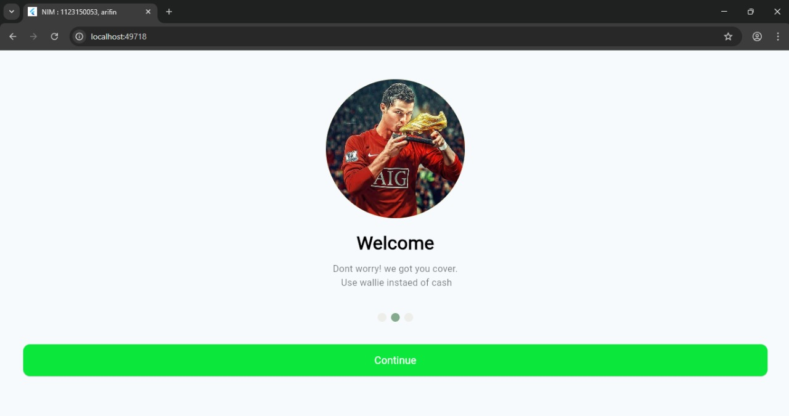
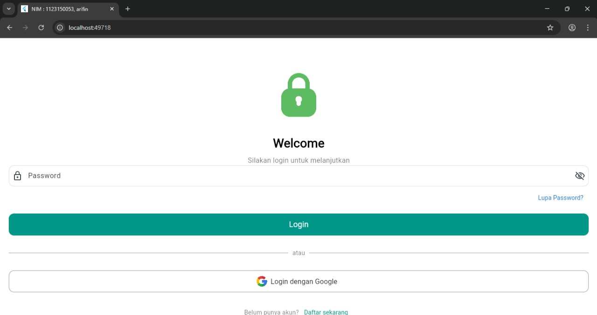

# 🧩 UTS Pemrograman Mobile (KB1179)

## 👤 Identitas Mahasiswa
    Nama : Muhammad Arifin
    NIM : 1123150053


---


## 🖼️ Hasil Screenshot

Tampilan halaman splash screen aplikasi:






## ⚙️ Cara Menjalankan Project

1. Buka project di **Android Studio** atau **VS Code**.
2. Pastikan perangkat (emulator atau HP) sudah terhubung.
3. Jalankan perintah berikut di terminal:

   ```bash
   flutter run
   ```
4. Aplikasi akan berjalan langsung di perangkat.